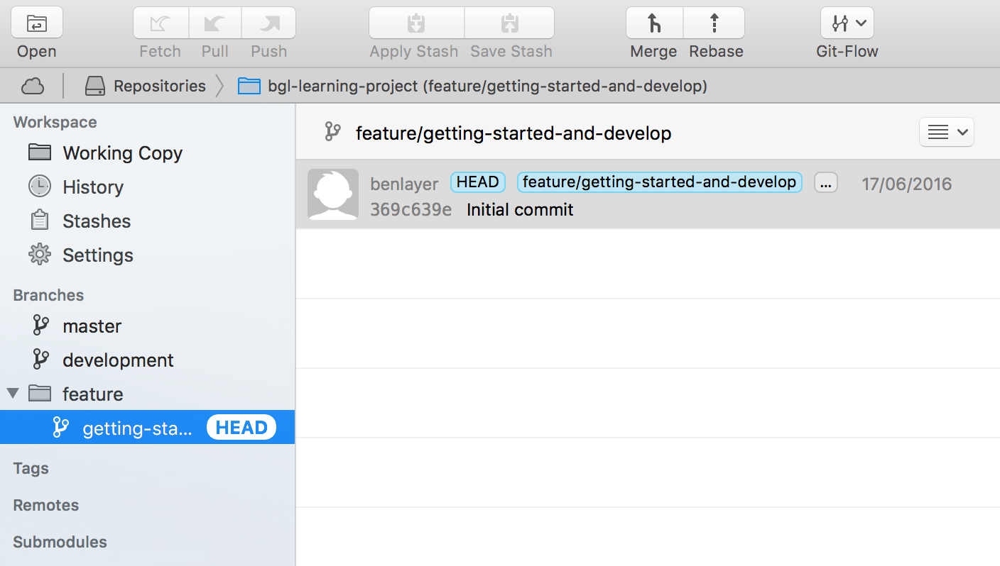

Gulp is node based task runner. It is an alternative to another commonly used task runner, Grunt, and seems to be growing in popularity in comparison to Grunt. Is it better than Grunt? Some argue yes, others no but what can be said is that Gulp favours coding over the configuration style of Grunt. This allows for greater flexibiliy and often the quicker completion of tasks.

In this post I'm going to go over learning to set up Gulp to be used on a project. This is the first of these posts and I'm starting here becuase it seems a logical first step when setting up something new. Overall I hope that when these posts are taken as a whole they describe a logical (and probably very long-winded) process to creating a web app. (Something that will then need to evolve over time given the quickly changing world of front-end development).

### Initial setup

Let's start by creating a new repository and running `git init` from our command line to initialise it as a git repository so that we can track our changes.

Make new directory  
`mkdir bgl-learning-project`

Initialise with git  
`git init`

Let's then create README.md  
`touch README.md`

Before making our initial commit  
`git status`  
`git add .`  
`git commit -m "Initial commit"` 

For the sake of good practice on live projects, I'm also going to create a development branch and work on feature branches from this- most likely using a feature branch for each of the posts I write.

To create and checkout the new branch called 'development' `git checkout -b development`
  
For simplicity, and because I'm quite visual as a person, I'm now going to use Tower to manage the creation of feature branches off development by enabling 'git flow'. The first feature branch being 'getting-started-and-gulp'. So we have something that looks a bit like this on Tower:



In this branch I'm now going to add a very simple front-end folder structure:

- src
  - img
     - img-name.extension
  - scripts
     - app.js
  - styles
     - app.css
- index.html

This will act as the starting point for a project. I'll make this using the standard `mkdir` and `touch` commands from the command line and then commit my changes with an appropriate message.  
`git commit -m "Add initial file structure"`

### Gulp

##### Install and setup
First create a package.json file where we can keep track of and manage the packages that we're going to install. To do this, in the root of your directory run the following command:  
`npm init`  
and for the time being proceed just by accepting all of the default settings.

Create a .gitignore file and include 'node_modules' within it. This will be useful when it comes to committing our changes as we don't want to commit our node_modules every time.

Now Gulp needs to be installed, so in terminal we're going to do this globally (only need to to do this once, the first time you install Gulp) and locally as a dev-dependancy of our project.

`npm install --global gulp`  
`npm install --save-dev gulp`

(do this in the root of your project file)

Now `touch gulpfile.js`

This is the file where we will write our gulp tasks for our project.

Go into your gulpfile and require 'gulp'.  
`var gulp = require('gulp');`

Now we have required gulp we can start writing some gulp tasks. First, let's commit our changes with an appropriate message.

(From now on, commit changes at appropriate points with helpful commit messages.)

##### Gulp Tasks
There are a number of things we might want our Gulp tasks to do, among them are:

- Process and minfify CSS
- Bundle (browserify/webpack?) and minify JS
- Optimize images for the web
- Lint files for errors
- Move minified files to a specific directory
- Automatically reload the browser upon making changes
- (Run automated tests?)

###### Automatically reload the browser- Browser-sync
`npm install --save-dev browser-sync`

then in gulpfile.js

`var browserSync = require('browser-sync').create(); `

Let's now create a default gulp task that will reload the when any of our files inside 'src' or our index.html changes:

``` 
gulp.task('default', function() {
  browserSync.init({
    server:'./'
  });
  gulp.watch('src/**/*', browserSync.reload);
  gulp.watch('*.html', browserSync.reload);
}); 
```

It would be worth checking that our changes are going to work along the way so add some information into your index.html, app.css and app.js. Run `gulp` in you terminal and then ff you then change the css, for example, you should see your page automatically reload.

###### Minify styles task

`npm install --save-dev gulp-minify-css`
`npm install --save-dev gulp-sourcemaps`

Require in gulpfile.js and create a basic minification task, outputting the result to a new directory 'dist/styles' and reloading the page. We use sourcemaps so that if we need to debug our css, it points back to the un-minified version which will make life an awful lot easier.

```
gulp.task('styles', function() {
  gulp.src(['src/styles/**/*.css'])
    .pipe(sourcemaps.init())
    .pipe(minifyCss())
    .pipe(sourcemaps.write())
    .pipe(gulp.dest('dist/styles'))
    .pipe(browserSync.stream());
});
```

Lets' add in a css pre-processor 'Sass':

`npm install --save-dev gulp-sass`
`npm install --save-dev gulp-autoprefixer`

We're going to compile our .scss (change the src!) and run it through autoprefixer (this will add cross-browser css rules based on 'caniuse.com') before minification.

```
gulp.task('styles', function() {
  gulp.src(['src/styles/app.scss'])
    .pipe(sourcemaps.init())
    .pipe(sass())
    .pipe(autoprefixer())
    .pipe(minifyCss())
    .pipe(sourcemaps.write())
    .pipe(gulp.dest('dist/styles'))
    .pipe(browserSync.stream());
});
```

then update our default task to run the styles task once by default and then only styles files are changed.

```
gulp.task('default', ['styles'], function() {
  browserSync.init({
    server:'./'
  });
  gulp.watch('src/styles/**/*.scss', ['styles']);
  gulp.watch('*.html', browserSync.reload);
});
```

Finally update index.html to load the minified stylesheet from the 'dist' directory.

(*You probably don't want the dist file in your git history so add it to your .gitignore as well.)

###### Minify JS task

`npm install --save-dev gulp-uglify`

Require in gulpfile.js and create a basic minification task, outputting the result to a new directory 'dist/scripts' and reloading the page. Again we use sourcemaps so that if we need to debug our js, it points back to the un-minified version which will make life an awful lot easier.

```
gulp.task('scripts', function() {
  gulp.src(['src/scripts/**/*.js'])
    .pipe(sourcemaps.init())
    .pipe(uglify())
    .pipe(sourcemaps.write())
    .pipe(gulp.dest('dist/scripts'))
    .pipe(browserSync.stream());
});
```
then again update our default task to run the scripts task once by default and then only when scripts files are changed.

```
gulp.task('default', ['styles', 'scripts'], function() {
  browserSync.init({
    server:'./'
  });
  gulp.watch('src/styles/**/*.scss', ['styles']);
  gulp.watch('src/scripts/**/*.js', ['scripts']);
  gulp.watch('*.html', browserSync.reload);
});
```

Finally update index.html to load the minified scripts from the 'dist' directory.

###### Minify Images task

`npm install --save-dev gulp-imagemin`
`npm install --save-dev gulp-cache`

Require in gulpfile.js and create a basic minification task, cacheing the results and outputting the result to a new directory 'dist/img' and reloading the page. We cache because optimising images is slow so we only want to optimise images that have changed.

```
gulp.task('images', function() {
  gulp.src(['src/img/**/*'])
    .pipe(imageMin())
    .pipe(gulp.dest('dist/img'))
    .pipe(browserSync.stream());
});
```
then add into our default task

```
gulp.task('default', ['styles', 'scripts', 'images'], function() {
  browserSync.init({
    server:'./'
  });
  gulp.watch('src/styles/**/*.scss', ['styles']);
  gulp.watch('src/scripts/**/*.js', ['scripts']);
  gulp.watch('src/img/**/*', ['images']);
  gulp.watch('*.html', browserSync.reload);
});
```

###### Minify Fonts task

This really simple as font files are already optimised! Just move them across to the dist folder in this task.

```
gulp.task('fonts', function() {
  return gulp.src('src/fonts/**/*')
  .pipe(gulp.dest('dist/fonts'))
});
```

###### Linting
It's a good idea to check the quality of your code as you wirte it so including a linter in your gulp tasks is a good idea. I'm going to use JSHint because it is easy to setup, but ESLint is probably better for ES6 and is even more configurable.
`npm install --save-dev jshint`  
`npm install --save-dev gulp-jshint`

to configure options for jshint include a .jshintrc file  
[www.jshint.com/docs/options](http://www.jshint.com/docs/options)

now we need a linting task

```
gulp.task('lint', function(){
  gulp.src('src/scripts/**/*.js')
  .pipe(jshint())
  .pipe(jshint.reporter('default'));
});
```
and we'll update our default task to run the lint everytime a scripts file is changed

```
gulp.task('default', ['styles', 'scripts', 'lint', 'images'], function() {
  browserSync.init({
    server:'./'
  });
  gulp.watch('src/styles/**/*.scss', ['styles']);
  gulp.watch('src/scripts/**/*.js', ['scripts', 'lint']);
  gulp.watch('src/img/**/*', ['images']);
  gulp.watch('*.html', browserSync.reload);
});
```

###### Cleaning up
What if we have files in our dist directory that we're longer using? We need to clean up and remove them!

`npm install del --save-dev`

Require in gulpfile.js and create a basic task that deletes the 'dist' directory. Then we can re-run our other task to re-build an updated version of it without any unused files.

```
gulp.task('clean:dist', function() {
  return del.sync('dist');
});
```

Gulp task get run simultaneously in our default task, so if we jsut put the clean task in there then if completes last then it our dist folder will just be deleted.

`npm install --save-dev run-sequence`

Require in gulpfile.js and create a 'build' task to run previosuly defined tasks once clean has finished. This doesn't need to be run every time, but certainly when we're thinking of deploying.

```
gulp.task('build', function() {
  runSequence('clean:dist', ['styles', 'scripts', 'lint', 'images', 'fonts']);
});
```
---

All of the above seems to be a pretty good basic setup and does a lot of useful things. There may be other things you want to do as well and it would simple to extend some of the tasks above to accomodate these or to write new tasks. Examples of extras to include might be:

- JavaScript modules
`npm install --save-dev browserify`  
(other plugins such as vinyl-source-stream and vinyl-buffer required as well.)
This could be added to the scripts task.

- Unit testing  
`npm install --save-dev gulp-mocha`(for example)
This could be a new 'unit-test' task, perhaps as part of an overall 'test' task.

- Accesability testing  
`npm install --save-dev gulp-a11y`
This could be a new 'accesability' task, perhaps also as part of an overall 'test' task.

---

I wouldn't to have been able to write this and learn a little about Gulp were it not for these excellent resources:

 - [https://css-tricks.com/gulp-for-beginners/](https://css-tricks.com/gulp-for-beginners/)
 - O'Reilly Learning Path- Introduction to the Modern Front-end Web.
 - [https://scotch.io/tutorials/automate-your-tasks-easily-with-gulp-js](https://scotch.io/tutorials/automate-your-tasks-easily-with-gulp-js)

